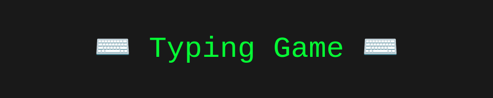
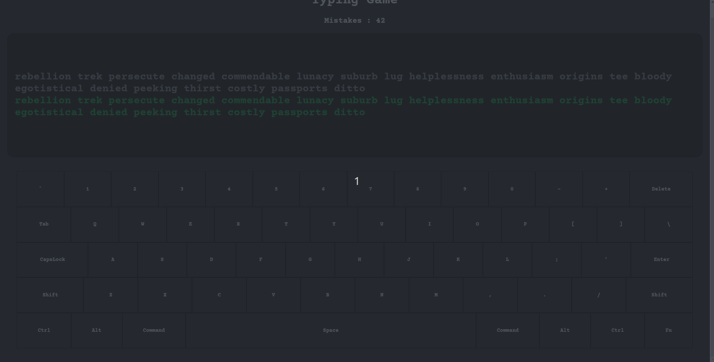

  

## A small static website to practice your typing ability.

### How to Play :

To start playing go to my [GitHub pages site](https://s-riches.github.io/typingGame/)

Then you will see a randomly generated collection of 20 words such as this 

To play you simply have to start typing the words, and every correct character you type the corresponding character will appear on the screen, like this: 

After finishing a word, press space to go to the next word. 

When typing a mistake you will see the mistake counter tick up and you will need to re-enter the correct character 

After finishing the word collection you must press space to reset your mistakes and generate a new set of words 

Please note that the keyboard on the screen is not interactive, it merely mimics your input to avoid you needing to look at your own keyboard to see what keys you are accidentally hitting.

## How the game works

##### Note: this isn't a comprehensive list of every block of code, but just the notable parts.

To start, the project has a local file called words.txt, a fork from [Dolph's dictionary](<[https://github.com/dolph/dictionary/blob/master/popular.txt](https://github.com/dolph/dictionary/blob/master/popular.txt)>) With which i read via a simple Fetch api call .png>)

What this does once it reads the files contents, it chooses 20 random words from the words file, and adds them to an array, and then returns the array asynchronously.

Then after receiving the array, the program then logs this to the screen, saving the `wordsStr` for later use. .png>)
After this we then do character checking in an event loop using this function to check if the character the user inputted is equal to the character at the position. This is also where we increment the mistakes in case of invalid input. The char checker is also responsible for reloading the page once the user hits the end of the sentence, which is always a space character. .png>)

Then finally to actually capture the users input we use a simple event listener, where it captures what key has been pressed, and feeds the `event.key` to the charChecker function. .png>)
